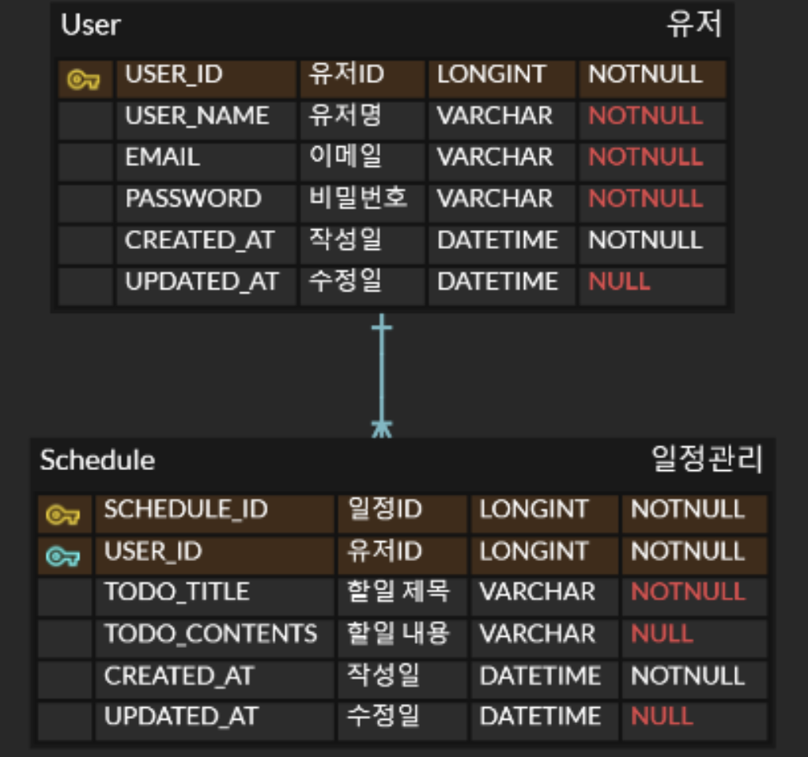

## 일정관리 앱 만들기

## API 명세서 
* **SCHEDULE** 

|      기능      	|       URL       	| Http Method 	|                                 Request                                 	|   응답 코드   	|                                                                          Response                                                                        	|
|:--------------:	|:---------------:	|:-----------:	|:-----------------------------------------------------------------------:	|:-------------:	|:--------------------------------------------------------------------------------------------------------------------------------------------------------:	|
| 일정 생성      	| /schedules      	| POST        	| { "id": 1, "todoTitle": "일정 제목", "todoContents": "일정 내용" }      	| 201 (CREATED) 	| { "id": 1, "todoTitle": "일정 제목", "todoContents": "일정 내용" }                                                                                       	|
| 모든 일정 조회 	| /schedules      	| GET         	| -                                                                       	| 200 (OK)      	| [{ "id": 1, "todoTitle": "일정 제목", "todoContents": "일정 내용", "createdAt": "2025-04-04T10:00:00", "updatedAt": "2025-04-04T10:00:00" }]             	|
| 특정 일정 조회 	| /schedules/{id} 	| GET         	| -                                                                       	| 200 (OK)      	| { "id": 1, "todoTitle": "일정 제목", "todoContents": "일정 내용", "createdAt": "2025-04-04T10:00:00", "updatedAt": "2025-04-04T10:00:00" }               	|
| 일정 수정      	| /schedules/{id} 	| PATCH       	| { "todoTitle": "새로운 일정 제목", "todoContents": "새로운 일정 내용" } 	| 200 (OK)      	| { "id": 1, "todoTitle": "새로운 일정 제목", "todoContents": "새로운 일정 내용", "createdAt": "2025-04-04T10:00:00", "updatedAt": "2025-04-04T10:30:00" } 	|
| 일정 삭제      	| /schedules/{id} 	| DELETE      	| -                                                                       	| 200 (OK)      	| -                                                                                                                                                        	|

* **USER**

|       기능       	|              URL              	| Method 	|                                          요청 본문                                          	|   응답 코드   	|                                 응답 본문                                	|
|:----------------:	|:-----------------------------:	|:------:	|:-------------------------------------------------------------------------------------------:	|:-------------:	|:------------------------------------------------------------------------:	|
| 회원가입         	| /users/signup                 	| POST   	| { "username": "사용자이름", "email": "이메일주소", "password": "비밀번호" }                 	| 201 (CREATED) 	| { "id": 1, "username": "사용자이름", "email": "이메일주소" }             	|
| 로그인           	| /users/login                  	| POST   	| { "email": "이메일주소", "password": "비밀번호" }                                           	| 200 (OK)      	| { "id": 1 }                                                              	|
| 로그아웃         	| /users/logout                 	| POST   	| -                                                                                           	| 200 (OK)      	| -                                                                        	|
| 모든 사용자 조회 	| /users                        	| GET    	| -                                                                                           	| 200 (OK)      	| [{ "id": 1, "username": "사용자이름", "email": "이메일주소" }]           	|
| 특정 사용자 조회 	| /users/{id}                   	| GET    	| -                                                                                           	| 200 (OK)      	| { "id": 1, "username": "사용자이름", "email": "이메일주소" }             	|
| 사용자 정보 수정 	| /users/{id}                   	| PATCH  	| { "username": "새로운사용자이름", "email": "새로운이메일주소", "password": "현재비밀번호" } 	| 200 (OK)      	| { "id": 1, "username": "새로운사용자이름", "email": "새로운이메일주소" } 	|
| 사용자 삭제      	| /users/{id}?password=비밀번호 	| DELETE 	| -                                                                                           	| 200 (OK)      	| -                                                                        	|

### ERD

### 에러코드ㅌ`
|            코드           	|           설명           	|
|:-------------------------:	|:------------------------:	|
| 200 OK                    	| 요청 성공                	|
| 201 CREATED               	| 리소스 생성 성공         	|
| 400 BAD REQUEST           	| 잘못된 요청 파라미터     	|
| 401 UNAUTHORIZED          	| 인증 실패 또는 권한 부족 	|
| 404 NOT FOUND             	| 리소스를 찾을 수 없음    	|
| 500 INTERNAL SERVER ERROR 	| 서버 측 오류             	|
