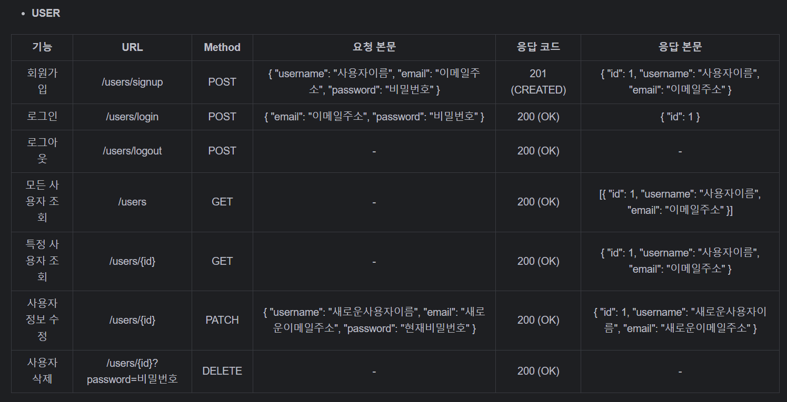

## 일정관리 앱 만들기

## API 명세서 
https://documenter.getpostman.com/view/43168025/2sB2cRD4ZA
* **SCHEDULE** 

* **USER**

### ERD

### 에러코드
|            코드           	|           설명           	|
|:-------------------------:	|:------------------------:	|
| 200 OK                    	| 요청 성공                	|
| 201 CREATED               	| 리소스 생성 성공         	|
| 400 BAD REQUEST           	| 잘못된 요청 파라미터     	|
| 401 UNAUTHORIZED          	| 인증 실패 또는 권한 부족 	|
| 404 NOT FOUND             	| 리소스를 찾을 수 없음    	|
| 500 INTERNAL SERVER ERROR 	| 서버 측 오류             	|
